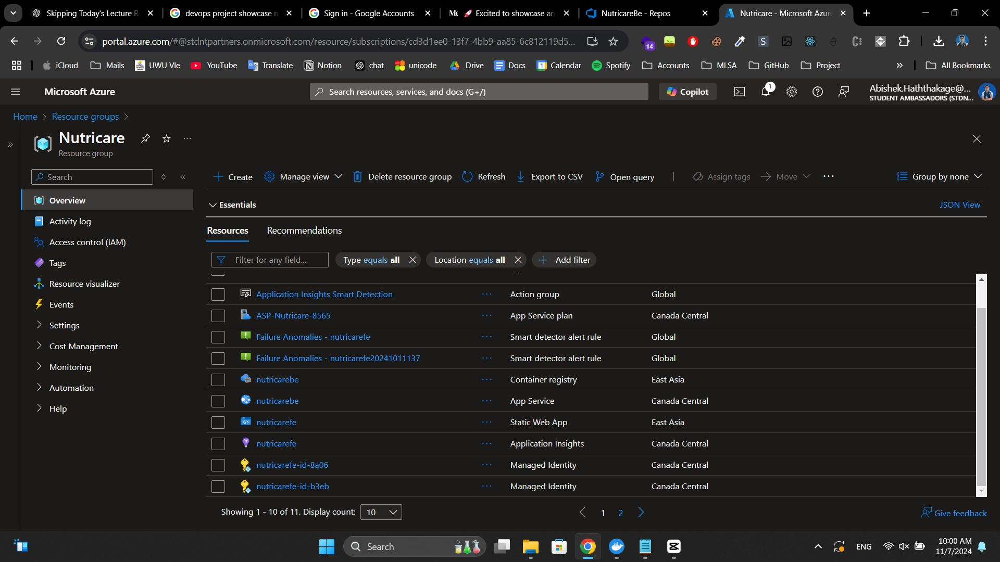

# NutriCare

NutriCare is an innovative web application designed to suggest personalized recipes based on specific health conditions. By leveraging AI technology, NutriCare helps users make better dietary choices and manage health concerns while promoting a balanced lifestyle. The platform also offers helpful resources like educational articles and a directory of healthcare professionals.

## Features

- **Health Condition Filters**: Tailored recipes based on user-reported illnesses.
- **Allergen Detection**: Identifies and avoids allergens in suggested recipes.
- **Educational Resources**: A variety of health-related articles to expand user knowledge.
- **Doctor Profiles**: A directory of healthcare providers with contact information and specialties.

## Live Demo

Experience NutriCare live!  
👉 [Live Demo Link](https://ashy-island-0ed3b1600.5.azurestaticapps.net/)

## Technology Stack

- **Frontend**: ReactJS & TailwindCSS
- **Backend**: Node.js & Express.js
- **Database**: MongoDB
- **AI Integration**: Azure OpenAI
- **Hosting**: Azure Web App, Docker
- **Containerization & CI/CD**: Azure Container Registry, Azure DevOps

## Backend Repository

For more details on the backend, check out the repository:  
👉 [Backend Repository Link](https://github.com/abhixsh/NutriCare_be)

## Screenshots

Here are a few screenshots of NutriCare in action:




## Running Locally

To run NutriCare locally, follow these steps:

### Clone the repositories:

**Frontend:**
```bash
git clone https://github.com/yourusername/NutriCare-Frontend.git
cd NutriCare-Frontend
```

**Backend:**
```bash
git clone https://github.com/yourusername/NutriCare-Backend.git
cd NutriCare-Backend
```

### Install dependencies for both frontend and backend:

**Frontend:**
```bash
cd NutriCare-Frontend
npm install
```

**Backend:**
```bash
cd NutriCare-Backend
npm install
```

### Start the development servers:

**Frontend:**
```bash
cd NutriCare-Frontend
npm start
```

**Backend:**
```bash
cd NutriCare-Backend
npm start
```

### Open your browser and navigate to:

```bash
http://localhost:3000
```

Make sure you have Node.js and npm installed on your machine before running these commands.